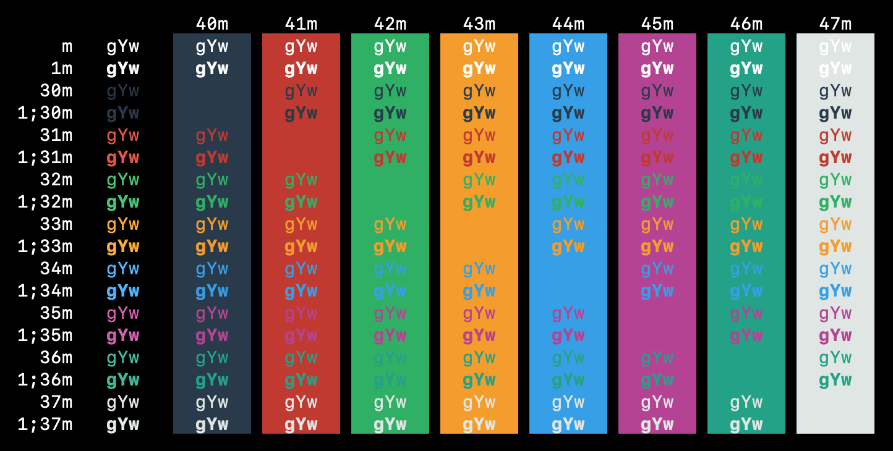

# Dark-Terminal-Profile
Color schemes for default macOS Terminal.app (Dark)

## Prerequisite
Since terminal themes are just color schemes, you need to enable color formatting for your shell first. For that, execute the following commands in order:
```
echo "export CLICOLOR=1" >> ~/.bash_profile
```
```
echo "export LSCOLORS=dxGxBxDxCxEgEdxbxgxcxd" >> ~/.bash_profile
```
```
echo "export PS1='\[\e[1;32m\]\h:\[\e[m\]\[\e[1;34m\W\e[m\] \[\e[1;35m\]\u\[\e[m\]\[\e[1;33m\]\$ \[\e[m\]'" >> ~/.bash_profile
```

## Installation Instructions
- Clone or download this repository.
- Double click on selected `Tanmay Dark.terminal` file. It will open a new Terminal window with that color scheme.
- Set the scheme as the default one with `Shell -> Use Settings as Default`

## Screenshot

